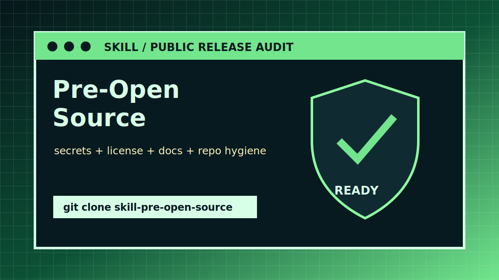

# Pre-Open Source

[中文说明](README.zh-CN.md)

[](https://world.guantou.site/)



A Codex skill for preparing a repository before making it public. It treats open-sourcing as a security, documentation, licensing, and product-readiness task rather than a last-minute README polish pass.

## What It Helps With

- Read-only pre-release audits.
- Sensitive-content and repository-hygiene checks.
- License, README, CONTRIBUTING, CODE_OF_CONDUCT, issue template, PR template, and `.gitignore` recommendations.
- Clean-publication strategy when history may contain secrets or private assets.
- Practical release-readiness reporting.

## Installation

```bash
git clone https://github.com/Leochens/skill-pre-open-source.git ~/.codex/skills/pre-open-source
```

Then ask Codex:

```text
Use $pre-open-source to prepare this repository for open sourcing.
```

## Usage Notes

This skill starts read-only for audits and requires explicit confirmation before destructive or public actions such as deleting files, rewriting history, pushing, publishing, or exposing suspected secrets.

The checklist in `references/checklist.md` covers project basics, README quality, licensing, sensitive content, `.gitignore`, contribution docs, issue/PR templates, tests, demos, quality, release readiness, and final publication.

## Repository Layout

```text
SKILL.md                    Skill instructions
agents/openai.yaml          Codex UI metadata
references/checklist.md     Full readiness checklist
```

## More From GuanTou Lab

This skill is part of GuanTou Lab's personal agent workflow toolkit. Visit [GuanTou World](https://world.guantou.site/) to see the broader project and product universe.

## License

MIT License. See [LICENSE](LICENSE).
